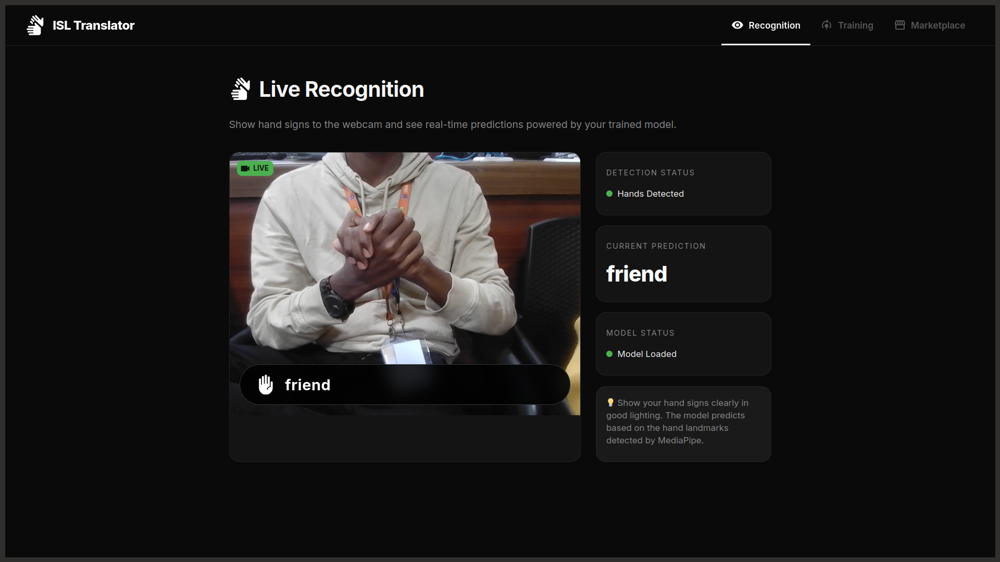
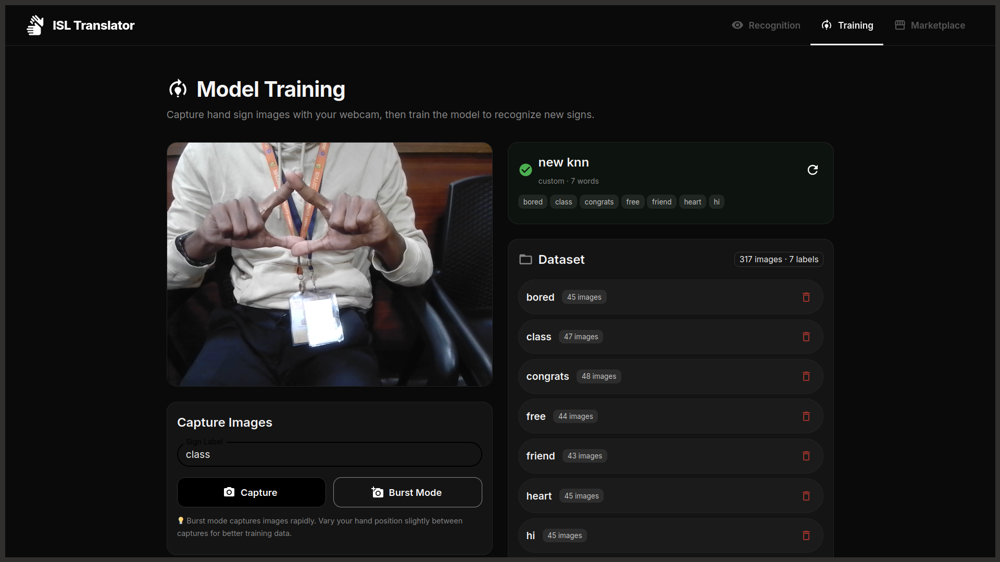
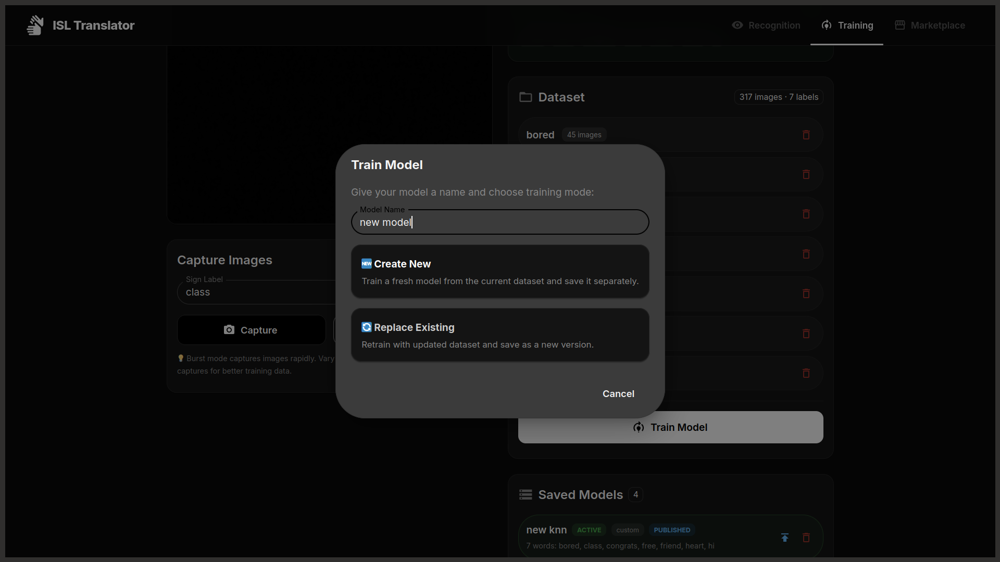
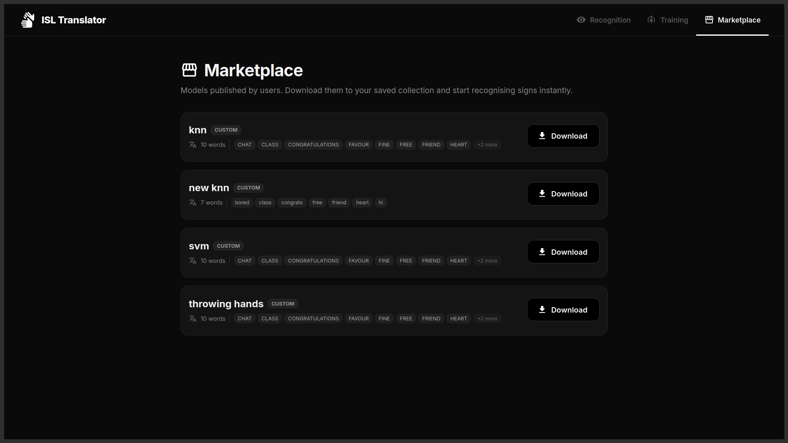
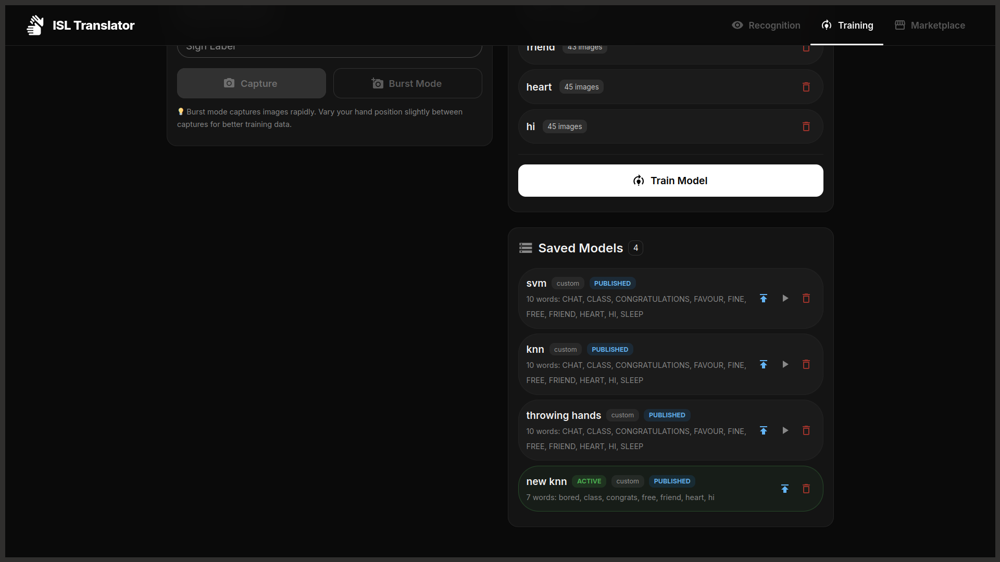

# ISL Translator

A real-time Indian Sign Language (ISL) translator that uses MediaPipe hand landmark detection and machine learning to recognise hand signs from a webcam feed.

## Features

- **Real-time recognition** — live webcam feed with instant sign prediction
- **Custom training** — capture images, label them, and train your own models
- **Model marketplace** — publish trained models for others to download
- **Multi-hand detection** — detects up to 2 hands simultaneously
- **Model management** — save, switch, and delete trained models

## Project Screenshots






## Tech Stack

| Layer | Technology |
|---|---|
| Backend | Flask, MediaPipe, scikit-learn |
| Frontend | React, Material UI, Vite |
| Database | SQLite |
| ML Model | KNN (K-Nearest Neighbors) |

## Prerequisites

- **Python 3.10+**
- **Node.js 18+** and npm

## Setup

### 1. Clone the repository

```bash
git clone <repo-url>
cd isl-sign-language
```

### 2. Backend (Python)

> **Recommended:** Use a virtual environment to avoid dependency conflicts.

```bash
# Create and activate a virtual environment
python -m venv venv
source venv/bin/activate        # Linux / macOS
# venv\Scripts\activate          # Windows

# Install dependencies
pip install -r requirements.txt
```

### 3. Download MediaPipe model

Download the hand landmarker model to the project root:

```bash
wget -O hand_landmarker.task https://storage.googleapis.com/mediapipe-models/hand_landmarker/hand_landmarker/float16/latest/hand_landmarker.task
```

### 4. Frontend (React)

```bash
cd frontend
npm install
```

## Running

Open **two terminals**:

**Terminal 1 — Backend:**
```bash
# Activate venv if not already active
source venv/bin/activate

python app.py
# Runs on http://localhost:5000
```

**Terminal 2 — Frontend:**
```bash
cd frontend
npm run dev
# Runs on http://localhost:5173
```

Open **http://localhost:5173** in your browser.

## Usage

### Recognition Tab
Point your webcam at a hand sign and the model will predict the sign in real-time.

### Training Tab
1. Enter a label name (e.g. "Hello", "A", "Thank You")
2. Click **Capture** to take images of the sign (10–50 images recommended)
3. Repeat for each sign you want to train
4. Click **Train Model**, give it a name, and train
5. The trained model is saved and can be activated from the **Saved Models** panel
6. Click the **Publish** icon to share your model in the marketplace

### Marketplace Tab
Browse and download models published by other users.

## Project Structure

```
isl-sign-language/
├── app.py                  # Flask backend + MediaPipe + ML
├── db.py                   # SQLite database layer
├── requirements.txt        # Python dependencies
├── hand_landmarker.task    # MediaPipe hand model
├── saved_models/           # Trained model files (.joblib)
├── dataset/                # Captured training images
├── models.db               # SQLite database (auto-created)
└── frontend/
    ├── src/
    │   ├── App.jsx         # Main app with tab navigation
    │   ├── api.js          # Backend API client
    │   ├── theme.js        # MUI dark theme
    │   └── pages/
    │       ├── RecognitionPage.jsx
    │       ├── TrainingPage.jsx
    │       └── MarketplacePage.jsx
    └── package.json
```
